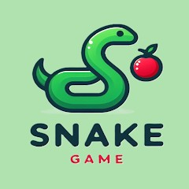

A driven and enthusiastic Computer Science graduate with a solid programming background, seeking an opportunity in the software industry. Passionate about leveraging technical expertise and hands-on experience from academic projects and internships to develop innovative software solutions. Dedicated to ongoing learning and professional development in a fast-paced, collaborative setting.

## projects
### Snake Game
[Project](https://github.com/Avinash4538/Snake-game)

This Project involves developing a game where the player controls a growing snake that moves in a set direction. The main objectives include collecting food to increase the snake’s length while avoiding collisions with itself and the game boundaries. The project typically includes features such as user controls, score tracking, increasing difficulty, and smooth movement. 

### Vulnerability Assesment
[Project](https://github.com/Avinash4538/Vulnerability-Assesment.git)

This project Full Stack Web Application for Vulnerability Assessment and Network Scanning aims to create a web-based platform that helps users identify security vulnerabilities in networks and systems. The application integrates front-end, back-end, and database technologies to provide real-time scanning, reporting, and analysis of potential threats.

### AI-Image-Generator
[project](https://github.com/Avinash4538/AI-Image-Generator.git)

This AI-Image-Generator project is a web-based application that leverages artificial intelligence to generate images based on user-provided text prompts. It utilizes deep learning models, such as Stable Diffusion, DALL·E, or GANs, to create high-quality and realistic images.

### Mister-Roboto-Arigato-Store
[project](https://github.com/Avinash4538/Mister-Roboto-Arigato-Store.git)

This Mister-Roboto-Arigato-Store project appears to be an e-commerce platform focused on selling robotics-related products, gadgets, or AI-powered tools. It could be a web-based store featuring a variety of tech products, components, or even AI-driven automation tools.

